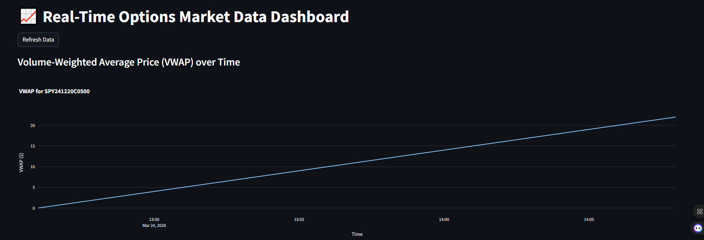
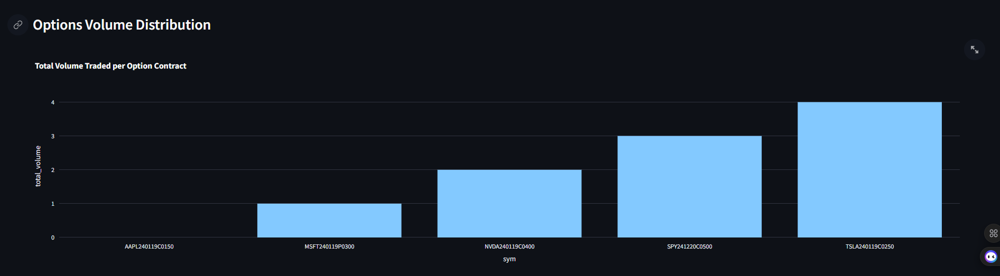

# Real-Time Options Market Data Dashboard

An end-to-end local streaming pipeline project for the Data Engineering Zoomcamp.

## Architecture & Technologies
- Data ingestion: Python mock options producer
- Stream broker: Redpanda
- Stream processing: local Kafka consumer and aggregator
- Database: PostgreSQL
- Dashboard: Streamlit
- Local orchestration: Docker Compose

## Local Setup

### 1. Create your local env file
Copy `.env.example` to `.env`.

Recommended local values:
```env
POLYGON_API_KEY=replace-me
KAFKA_BROKER=localhost:9092
POSTGRES_HOST=localhost
POSTGRES_PORT=5432
POSTGRES_DATABASE=options_dashboard
POSTGRES_USER=postgres
POSTGRES_PASSWORD=postgres
```

### 2. Start local infrastructure
From `projects/options-dashboard`:
```bash
make local-up
```

This starts:
- Redpanda on `localhost:9092`
- PostgreSQL on `localhost:5432`

### 3. Install Python dependencies
```bash
make producer-install
make streaming-install
make dashboard-install
```

### 4. Create the database table
```bash
make create-table
```

### 5. Run the producer
```bash
make producer-run
```

### 6. Run the dashboard
```bash
make dashboard-run
```

## Streaming Job

The active local streaming path uses `streaming/local_aggregator.py` to read Kafka events, compute 1-minute VWAP aggregates, and write them into PostgreSQL.

## Notes

- The old AWS/Terraform deployment path has been removed from this project.
- Do not commit `.env`.
- Treat any previously exposed AWS credentials as permanently compromised.

## Dashboard Previews



